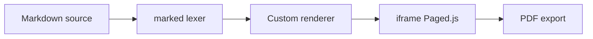

# Typographie & Mise en forme

## Titres et hiérarchie

Les titres H1 et H2 reçoivent automatiquement la couleur de section BEORN, calculée à partir du numéro de fichier. Le numéroteur et le trait de couleur sous H1 s'affichent uniquement si un numéro de partie est détecté dans le nom de fichier. {:style mt=4}

### Niveau 3 — Sous-section

#### Niveau 4

- a
    - b

##### Niveau 5

###### Niveau 6

## Corps de texte

Paragraphe en **Nunito**. La typographie française est automatique : les espaces insécables sont insérées avant les signes de ponctuation double — deux-points, point-virgule ; point d'exclamation ! point d'interrogation ?

Mise en forme inline : **gras**, *italique*, ***gras italique***, `code inline`, ~~barré~~.

Les [liens hypertextes](https://beorntech.com) sont soulignés dans le rendu.

## Listes

### Non ordonnée

- Premier élément de liste
- Deuxième élément
  - Sous-élément imbriqué au niveau 2
  - Autre sous-élément
    - Niveau 3 d'imbrication
- Troisième élément

### Ordonnée

1. Première étape
2. Deuxième étape
3. Troisième étape

## Citation

> L'excellence opérationnelle n'est pas une option — c'est l'engagement quotidien que nous portons pour chaque client, chaque projet, chaque ticket.

## Tableau

| Composant | Description            | Syntaxe             |
| --------- | ---------------------- | ------------------- |
| Alerte        | Bloc contextuel coloré | `:::info … :::`          |
| Stat tiles    | Tuiles chiffres        | `:::stat-tiles … :::`    |
| Heatmap       | Matrice calendrier     | `:::heatmap … :::`       |
| Timeline      | Frise étapes           | `:::timeline … :::`      |
| Numbered grid | Grille piliers         | `:::numbered-grid … :::` |

Alignement des colonnes :

| Gauche | Centré | Droite |
| :----- | :----: | -----: |
| A      | B      | C      |
| Foo    | Bar    | 42     |

## Code

Inline : `const editor = new PagedEditor({ workspace });`

Bloc syntaxiquement coloré :

```javascript
async function renderSection(md, options = {}) {
  const { body } = parseFrontmatter(md);
  const tokens = marked.lexer(body);
  const html = marked.parser(tokens);
  return wrapSection(html, options.colorIdx ?? 0);
}
```

## Règle horizontale

---

Le séparateur `---` sur sa propre ligne produit une ligne horizontale.


## Images

Image centrée avec largeur maximale :


Image alignée à droite en vignette :


Le texte qui suit une image alignée à gauche ou à droite s'écoule autour d'elle. L'option de largeur accepte toute unité CSS valide : `px`, `%`, `em`, `cm`…

## Saut de page

Le marqueur `:::newpage` sur sa propre ligne insère un saut de page Paged.js. Il peut apparaître à la fin d'un paragraphe, après une liste ou seul sur une ligne.

:::newpage

## Mermaid

Les diagrammes sont rendus via Mermaid 11 et mis en cache SVG pour éviter les re-rendus :


