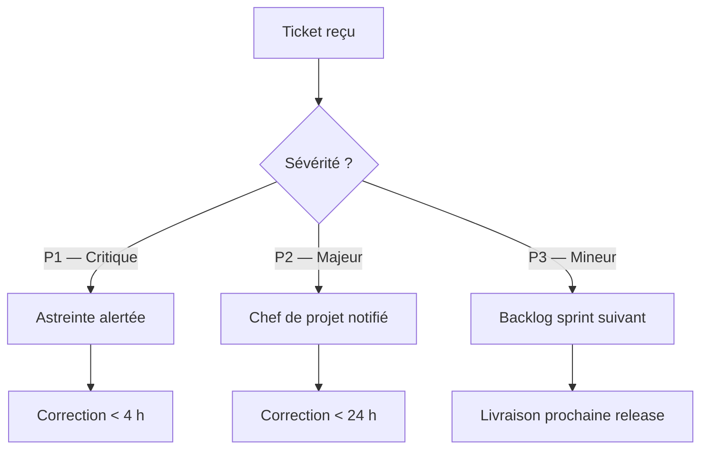

# Composants personnalisés

## Alertes

Six variantes de blocs contextuels. Le corps accepte du Markdown complet.

:::info
**Information** — Contexte neutre, donnée complémentaire ou rappel de procédure.
:::

/spacer[20px]

:::warning
**Attention** — Avertissement modéré nécessitant vigilance avant d'agir.
:::

:::danger
**Critique** — Risque fort ou action bloquante. Intervention immédiate requise.
:::

:::success
**Succès** — Validation positive d'un état, d'une livraison ou d'une action accomplie.
:::

:::note
**Note** — Annotation éditoriale ou précision annexe au contenu principal.
:::

:::tip
**Conseil** — Bonne pratique ou astuce opérationnelle à retenir.
:::

## Stat tiles

Tuiles chiffres : une ligne par tuile, syntaxe `VALEUR | LIBELLÉ | NOTE (optionnel)`.

:::stat-tiles
18 ans | Expertise portails | Depuis 2007
100+ | Projets livrés
< 4 h | Temps de réponse garanti | SLA P1
99,9 % | Disponibilité cible
:::

## Numbered grid

Grille de piliers numérotés automatiquement (max 7). Syntaxe : `TITRE | PITCH`.

:::numbered-grid
Qualité | Zéro régression, revue systématique à chaque livraison
Réactivité | SLA < 4 h, astreinte 24/7 pour les incidents critiques
Sécurité | DevSecOps intégré, OWASP, audits trimestriels
Innovation | IA générative, automatisation, veille technologique active
Durabilité | Green IT, écoconception, bilan carbone annuel publié
Transparence | Reporting temps réel, accès aux dashboards de suivi
:::

/newpage

## Citation

Bloc `:::quote` avec attributs `author` et `role`.

:::quote author="Olivier Bonnet" role="Co-gérant, BEORN Technologies"
La confiance se construit dans les moments difficiles. Notre objectif est d'être le partenaire que nos clients appellent en premier quand quelque chose ne va pas — parce qu'ils savent que nous allons résoudre le problème.
:::

## Frise chronologique

Conteneur `:::timeline` avec sous-headers `:::step TITRE | MÉTA`.

:::timeline
:::step Cadrage & audit | Semaines 1–2
Collecte des besoins, inventaire applicatif et définition des indicateurs de référence.

- Ateliers de cadrage avec les équipes métier
- Audit de code et cartographie des flux existants
- Mise en place des outils de ticketing et de reporting

:::step Environnement & intégration | Semaines 3–4
Déploiement des environnements de développement et de recette, pipeline CI/CD opérationnel.

- Chaîne de livraison continue configurée et testée
- Première batterie de tests de non-régression passée

:::step Recette & corrections | Semaines 5–6
Validation fonctionnelle avec les référents métier, correction des anomalies identifiées.

- 100 % des cas de tests de recette validés
- Documentation technique livrée

:::step Go-Live | Semaine 7
Basculement en production avec surveillance renforcée et support prioritaire pendant 72 h.
:::

/newpage

## Prestations détaillées

Conteneur `:::card-grid` avec sous-headers `:::card TITRE | PHASE`.

:::card-grid
:::card Audit & Initialisation | Phase 1
- Inventaire des applications en scope
- Cartographie des flux et des dépendances
- Plan de charge prévisionnel validé

:::card Maintenance corrective | En continu
- Analyse et correction des anomalies (P1/P2/P3)
- Gestion du backlog de bugs et suivi SLA
- Reporting mensuel de disponibilité

:::card Projets agiles | Sprints de 2 semaines
- Backlog produit copiloté avec le métier
- Démos et rétrospectives à chaque sprint
- Livraisons continues en environnement de recette

:::card Sécurité & Conformité | Trimestriel
- Audits de sécurité applicative (OWASP)
- Veille CVE et application des patches critiques
- Mise à jour de la documentation PSSI
:::

## Heatmap

Conteneur `:::heatmap` : bloc de config YAML-like, séparateur `---`, puis lignes `TITRE | cellules`.

Cellules : `X` ou `■` = actif, `o` ou `•` = événement, tout autre caractère = inactif.

Phases de colonnes : `:mise` (mise en place), `:expl` (exploitation), `:fin` (fin de contrat).

:::heatmap
columns: T1:mise, T2:mise, T3:expl, T4:expl, T5:expl, T6:expl, T7:expl, T8:fin
milestones: Démarrage@0, Recette@2:Semaine 6, Go-Live@3:Jalon contractuel, Bilan@8
---
Initialisation | X X . . . . . .
Maintenance corrective | . X X X X X X X
Projets agiles | . . X X X X X .
Audits sécurité | . . o . . o . .
Reporting | . o . o . o . o
Bilan final | . . . . . . . X
:::

/newpage

## Grille multi-colonnes

Bloc fencé ` ```ao-grid ` avec sous-headers `:::col-N` (N = largeur sur 12 colonnes).

```ao-grid
:::col-7

### Colonne principale (7/12)

La grille `ao-grid` divise la ligne en 12 colonnes. Chaque `:::col-N` ouvre une colonne de largeur N. Le contenu est du Markdown standard.

- Les colonnes peuvent contenir listes, tableaux, alertes
- Le total des N peut dépasser 12 (retour à la ligne automatique)
- Aucune fermeture explicite nécessaire

:::col-5

### Colonne secondaire (5/12)

| Indicateur    | Valeur |
| ------------- | ------ |
| Disponibilité | 99,9 % |
| MTTR          | < 2 h  |
| SLA P1        | 4 h    |

:::tip
Les colonnes peuvent contenir des alertes et des composants imbriqués.
:::
```

## Diagramme Mermaid

Les diagrammes sont rendus en SVG via Mermaid 11 et mis en cache pour éviter les re-rendus inutiles.


