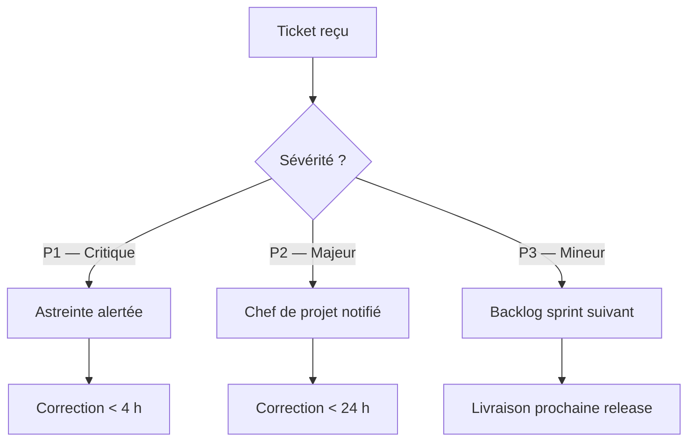

# Composants personnalisés

## Alertes

Six variantes de blocs contextuels. Le corps accepte du Markdown complet.

:::info
**Information** — Contexte neutre, donnée complémentaire ou rappel de procédure.
:::

:::spacer 20px

:::warning
**Attention** — Avertissement modéré nécessitant vigilance avant d'agir.
:::

:::danger
**Critique** — Risque fort ou action bloquante. Intervention immédiate requise.
:::

:::success
**Succès** — Validation positive d'un état, d'une livraison ou d'une action accomplie.
:::

:::note
**Note** — Annotation éditoriale ou précision annexe au contenu principal.
:::

:::tip
**Conseil** — Bonne pratique ou astuce opérationnelle à retenir.
:::

## Stat tiles

Tuiles chiffres : une ligne par tuile, syntaxe `VALEUR | LIBELLÉ | NOTE (optionnel)`.

:::stat-tiles
18 ans | Expertise portails | Depuis 2007
100+ | Projets livrés
< 4 h | Temps de réponse garanti | SLA P1
99,9 % | Disponibilité cible
:::

## Numbered grid

Grille de piliers numérotés automatiquement (max 7). Syntaxe : `TITRE | PITCH`.

:::numbered-grid
Qualité | Zéro régression, revue systématique à chaque livraison
Réactivité | SLA < 4 h, astreinte 24/7 pour les incidents critiques
Sécurité | DevSecOps intégré, OWASP, audits trimestriels
Innovation | IA générative, automatisation, veille technologique active
Durabilité | Green IT, écoconception, bilan carbone annuel publié
Transparence | Reporting temps réel, accès aux dashboards de suivi
:::

:::newpage

## Citation

Bloc `:::quote` avec attributs `author` et `role`.

:::quote author="Olivier Bonnet" role="Co-gérant, BEORN Technologies"
La confiance se construit dans les moments difficiles. Notre objectif est d'être le partenaire que nos clients appellent en premier quand quelque chose ne va pas — parce qu'ils savent que nous allons résoudre le problème.
:::

## Frise chronologique

Conteneur `:::timeline` avec sous-headers `:::step TITRE | MÉTA`.

:::timeline
:::step Cadrage & audit | Semaines 1–2
Collecte des besoins, inventaire applicatif et définition des indicateurs de référence.

- Ateliers de cadrage avec les équipes métier
- Audit de code et cartographie des flux existants
- Mise en place des outils de ticketing et de reporting

:::step Environnement & intégration | Semaines 3–4
Déploiement des environnements de développement et de recette, pipeline CI/CD opérationnel.

- Chaîne de livraison continue configurée et testée
- Première batterie de tests de non-régression passée

:::step Recette & corrections | Semaines 5–6
Validation fonctionnelle avec les référents métier, correction des anomalies identifiées.

- 100 % des cas de tests de recette validés
- Documentation technique livrée

:::step Go-Live | Semaine 7
Basculement en production avec surveillance renforcée et support prioritaire pendant 72 h.
:::

:::newpage

## Prestations détaillées

Cartes standalone `:::card title="…" phase="…" num="…"` embarquées dans une `:::ao-grid` pour la disposition en grille (4-up + rotation de palette via `nth-of-type`).

:::ao-grid
:::card title="Audit & Initialisation" phase="Phase 1" num="01"

- Inventaire des applications en scope
- Cartographie des flux et des dépendances
- Plan de charge prévisionnel validé

:::

:::card title="Maintenance corrective" phase="En continu" num="02"

- Analyse et correction des anomalies (P1/P2/P3)
- Gestion du backlog de bugs et suivi SLA
- Reporting mensuel de disponibilité

:::

:::card title="Projets agiles" phase="Sprints de 2 semaines" num="03"

- Backlog produit copiloté avec le métier
- Démos et rétrospectives à chaque sprint
- Livraisons continues en environnement de recette

:::

:::card title="Sécurité & Conformité" phase="Trimestriel" num="04"

- Audits de sécurité applicative (OWASP)
- Veille CVE et application des patches critiques
- Mise à jour de la documentation PSSI

:::
:::

## Fiches fonctionnelles

Fiches standalone `:::feature` embarquées dans `:::ao-grid` pour la disposition (`layout="row"` = pleine largeur, `layout="col"` = demi-largeur).

Statuts : `conforme` · `conforme_standard` · `conforme_dev` · `partiel_standard` · `partiel_dev` · `non_conforme` · `parametrage` · `a-verifier` · `preciser`. Niveaux : `obligatoire` · `souhaitee` · `information` · `optionnel`.

Sources multiples via `sources="Label A|Label B"` + `sourcesHref="url-a|url-b"` (pipe-séparés). Le format JSON `coverageSources='[{"label":"…","url":"…"}]'` est aussi supporté (généré automatiquement par l'ao-analyser).

:::ao-grid
:::feature title="Éditeur WYSIWYG" requirement="La plateforme doit fournir un éditeur WYSIWYG riche permettant aux contributeurs non techniques de produire du contenu mis en forme sans connaissance HTML." status="conforme_standard" level="obligatoire" ref="FN-12" sources="LumApps Help — Rich text editor|LumApps Help — Styles de paragraphes" sourcesHref="https://docs.lumapps.com/docs/help-content-rte|https://docs.lumapps.com/docs/help-content-paragraph-styles"
Barre d'outils complète (gras, italique, listes, liens, tables) et styles de paragraphes natifs. Copier-coller depuis Word géré.
:::

:::feature title="Versioning des articles" requirement="Chaque article doit conserver l'historique de ses versions successives et permettre la restauration d'une version antérieure par un utilisateur autorisé." status="conforme_standard" level="obligatoire" ref="FN-18" sources="LumApps Help — Content version history|LumApps Help — Restore version" sourcesHref="https://docs.lumapps.com/docs/help-content-version-history-restore|https://docs.lumapps.com/docs/help-content-restore"
Onglet _Versions_ automatique à chaque save/publish/archive. Restauration d'une version antérieure via la permission dédiée.
:::

:::feature title="Brouillons d'articles" requirement="Les contributeurs doivent pouvoir enregistrer un article en brouillon, non visible des lecteurs finaux, et le reprendre ultérieurement avant publication." status="conforme_standard" level="obligatoire" ref="FN-21" caption="Exemple — brouillon en back-office" layout="row" sources="LumApps Help — Save as draft|LumApps Help — Schedule publication|BEORN expertise" sourcesHref="https://docs.lumapps.com/docs/help-content-draft-publish-schedule|https://docs.lumapps.com/docs/help-content-schedule|"
Fonction _Save as draft_ native sur tous les types de contenu. Statut explicite, visible par les seuls éditeurs. Également disponible sur les posts d'espaces (draft, publish, schedule).
:::

:::feature title="Transfert en masse" requirement="L'administrateur doit pouvoir transférer en masse la propriété éditoriale d'articles d'un contributeur vers un autre (ex. départ collaborateur)." status="partiel_dev" level="obligatoire" ref="FN-27" sources="BEORN — Mémo intégration LumApps §4.2|LumApps API Reference" sourcesHref="|https://docs.lumapps.com/docs/api-content-transfer"
Les actions groupées sont limitées à la suppression multi-sélection. Le transfert d'auteur en masse passe par script d'administration ou API.
:::

:::feature title="Digest hebdomadaire" requirement="La plateforme doit envoyer un digest hebdomadaire personnalisé reprenant les nouveaux contenus pertinents pour chaque collaborateur." status="conforme_dev" level="souhaitee" ref="FN-34" sources="LumApps Help — Newsletters & Journeys|LumApps Help — Content selection" sourcesHref="https://docs.lumapps.com/docs/help-newsletters-journeys-content-selection|https://docs.lumapps.com/docs/help-content-selection"
Module _Newsletters_ natif avec _Content selection_ et _Journeys_ pour automatiser les envois récurrents. La politique éditoriale reste à paramétrer côté administrateur.
:::
:::

## Heatmap

Conteneur `:::heatmap` : bloc de config YAML-like, séparateur `---`, puis lignes `TITRE | cellules`.

Cellules : `X` ou `■` = actif, `o` ou `•` = événement, tout autre caractère = inactif.

Phases de colonnes : `:mise` (mise en place), `:expl` (exploitation), `:fin` (fin de contrat).

:::heatmap
columns: T1:mise, T2:mise, T3:expl, T4:expl, T5:expl, T6:expl, T7:expl, T8:fin
milestones: Démarrage@0, Recette@2:Semaine 6, Go-Live@3:Jalon contractuel, Bilan@8

---

Initialisation | X X . . . . . .
Maintenance corrective | . X X X X X X X
Projets agiles | . . X X X X X .
Audits sécurité | . . o . . o . .
Reporting | . o . o . o . o
Bilan final | . . . . . . . X
:::

:::newpage

## Grille multi-colonnes

Conteneur `:::ao-grid` avec sous-headers `:::col-N` (N = largeur sur 12 colonnes) ou `:::col` (largeur auto, partage équitable des colonnes restantes).

:::ao-grid
:::col-7

### Colonne principale (7/12)

La grille `ao-grid` divise la ligne en 12 colonnes. Chaque `:::col-N` ouvre une colonne de largeur N. Le contenu est du Markdown standard.

- Les colonnes peuvent contenir listes, tableaux, alertes
- Le total des N peut dépasser 12 (retour à la ligne automatique)
- Aucune fermeture explicite nécessaire

:::col-5

### Colonne secondaire (5/12)

| Indicateur    | Valeur |
| ------------- | ------ |
| Disponibilité | 99,9 % |
| MTTR          | < 2 h  |
| SLA P1        | 4 h    |

:::tip
Les colonnes peuvent contenir des alertes et des composants imbriqués.
:::

:::

:::spacer 20px

Sans largeur explicite, les colonnes se partagent les 12/12 à parts égales :

:::ao-grid
:::col

**Auto 1/3** — première colonne sans largeur déclarée.

:::col

**Auto 1/3** — deuxième colonne, même largeur.

:::col

**Auto 1/3** — troisième colonne, même largeur.

:::

:::spacer 20px

Mixte : largeur explicite + largeur auto sur les colonnes restantes.

:::ao-grid
:::col-6

**Fixe 6/12** — moitié gauche sur largeur explicite.

:::col

**Auto 3/12** — partage les 6 colonnes restantes.

:::col

**Auto 3/12** — partage les 6 colonnes restantes.

:::

## Diagramme Mermaid

Les diagrammes sont rendus en SVG via Mermaid 11 et mis en cache pour éviter les re-rendus inutiles.

