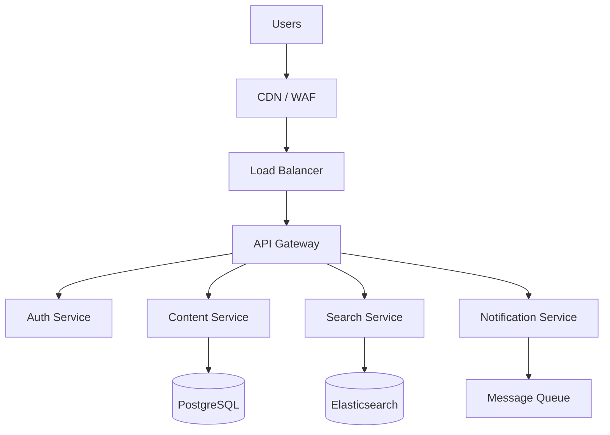

# Technical Approach

## Techitecture Overvie

Our proposed architecture follows a cloud-native, microservices-based design that ensures high availability, scalability, and maintainability.

### Key Design Principles

- **Separation of Concerns** — Each service owns its data and business logic
- **Event-Driven** — Asynchronous communication via message queues
- **API-First** — All functionality exposed through versioned REST APIs
- **Infrastructure as Code** — Terraform modules for reproducible deployments

## Technology Stack

| Layer          | Technology            | Rationale                                       |
| -------------- | --------------------- | ----------------------------------------------- |
| Frontend       | React 19 + TypeScript | Modern, type-safe, large ecosystem              |
| Backend        | Node.js + Express     | Fast development, shared language with frontend |
| Database       | PostgreSQL 16         | Robust, JSONB support, full-text search         |
| Search         | Elasticsearch 8       | Advanced search, faceting, autocomplete         |
| Cache          | Redis 7               | Session store, real-time pub/sub                |
| Queue          | RabbitMQ              | Reliable async messaging                        |
| Infrastructure | Kubernetes on GCP     | Auto-scaling, self-healing                      |

## Security Architecture

Security is integrated at every layer of the architecture :

1. **Network** — VPC isolation, private subnets, WAF rules
2. **Authentication** — SAML 2.0 SSO with Azure AD, TOTP-based MFA
3. **Authorization** — RBAC with attribute-based access control (ABAC)
4. **Data** — AES-256 encryption at rest, TLS 1.3 in transit
5. **Audit** — Comprehensive logging with tamper-proof storage

## Integration Strategy

### Office 365 Integration

We use the Microsoft Graph API to provide deep integration :

- Calendar synchronization (bidirectional)
- SharePoint document library browsing
- Teams presence and messaging
- OneDrive file picker

### SAP Integration

Connection via SAP Cloud Connector with RFC/BAPI calls for :

- Employee master data synchronization
- Leave and absence management
- Organizational structure

\newpage

## Performance Targets

| Metric            | Target  | Measurement     |
| ----------------- | ------- | --------------- |
| Page Load Time    | < 2s    | 95th percentile |
| API Response Time | < 200ms | 99th percentile |
| Search Response   | < 500ms | 95th percentile |
| Uptime            | 99.9%   | Monthly SLA     |
| Concurrent Users  | 5,000+  | Peak load       |
